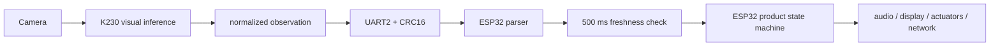

# K230 + ESP32 Architecture

## Decision

K230 is a dedicated visual coprocessor. ESP32 is the product controller.

This removes product real-time behavior from CanMV MicroPython while retaining
K230's useful hardware-accelerated camera, Ai2d, and KPU capabilities.

## Ownership

| Concern | Owner |
|---|---|
| Camera capture | K230 |
| Face detection and head pose | K230 |
| Visual observation normalization | K230 |
| UART frame publication | K230 |
| Product state machine | ESP32 |
| Buttons, audio, display, motors | ESP32 |
| WiFi and cloud communication | ESP32 |
| Watchdog and safe-state behavior | ESP32 |

## Data Flow

## K230 Runtime

`src/main_vision_uart.py`:

1. Initializes UART2 at 921600 baud.
2. Creates the K230 camera pipeline and head-pose detector.
3. Selects the largest valid face.
4. Publishes face observations, face-lost events, and heartbeats.
5. Never decides product expressions, actions, or cloud behavior.

The K230 may pause or restart. This must not block ESP32.

## ESP32 Runtime

`esp32/vision_receiver/vision_receiver.ino`:

1. Reads UART without blocking.
2. Incrementally finds frame magic and validates version, length, and CRC.
3. Updates the latest visual observation.
4. Marks vision unavailable after 500 ms without any valid frame.
5. Invokes ESP32-owned safe behavior when vision becomes unavailable.

## Protocol Messages

| Type | Value | Payload |
|---|---:|---|
| Heartbeat | 1 | Empty |
| Face | 2 | Normalized box, pose, confidence |
| Face lost | 3 | Empty |
| Error | 127 | Two-byte error code |

Face payload values:

| Value | Range |
|---|---|
| Center X/Y | `-1000..1000` |
| Width/height | `0..1000` |
| Pitch/yaw/roll | signed centidegrees |
| Confidence | `0..100` |

## Recovery Rules

- ESP32 ignores corrupt and unknown frames.
- ESP32 never waits for a K230 response.
- Missing K230 traffic triggers the ESP32 no-vision state.
- K230 inference failure emits an error frame when possible and cleans up.
- A K230 restart is tolerated because sequence wraparound and reset are valid.

## Legacy Code

The K230 voice, display, and network experiments remain for reference. They are
not modules in the target runtime and should not receive new product behavior.
